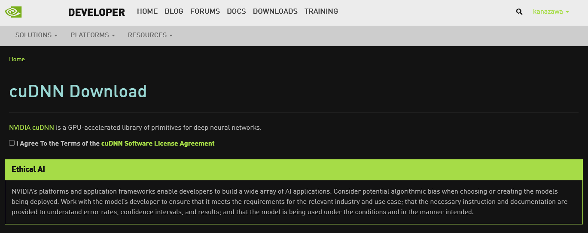

# Anaconda+TensorflowにGPUを設定する.

## 実行環境
Windows10 Pro
NVIDIA GeForce RTX 2060

MSVC 2019 (Microsoft Visual Studio C++)
CUDA v11.1.1
cuDNN 10.2 windows10-x64

Python 3.8.5
conda version 4.9.2
tensorflow-gpu 2.4.1
Keras 2.4.3

## GPUの設定
### MSVC(Microsoft Visual Studio C++)のインストール
1. Visual Studio communityをインストールする.
https://visualstudio.microsoft.com/ja/downloads/
2. コンポーネントの選択で, C++によるデスクトップ開発を選択する.

### CUDAのインストール
1. CUDA Toolkit Archiveからダウンロードする.
https://developer.nvidia.com/cuda-toolkit-archive
2. インストールを推奨設定でインストールする.

### cuDNNのインストール
1. 下のリンクからログイン/アカウント登録をする.
https://developer.nvidia.com/rdp/cudnn-download

2. ログインすると下のようなページがでるから「I Agree To the Terms of the cuDNN Software License Agreement」にチェックを入れてCuDNNをダウンロードする.
3. ダウンロードしたフォルダを解凍するとbin,lib,includeの3つのフォルダがある. これを「C:\Program Files\NVIDIA GPU Computing Toolkit\CUDA\v11.1」に上書きする.



1. ここまでで, 正しくGPU環境を設定できていれば, コマンドプロンプトから次のコマンドを実行して, 次のようになれば成功. 
```
$nvcc
nvcc fatal : No input files specified; use option --help for more information
```

### Tensorflow,KerasでGPUが使えることの確認
1. Pythonインタプリタで次を実行する.「 Successfully opened dynamic library cudart64_110.dll」となれば成功.

```python
>>> from tensorflow.python.client import device_lib
2021-04-23 19:04:39.518734: I tensorflow/stream_executor/platform/default/dso_loader.cc:49] Successfully opened dynamic library cudart64_110.dll

>>> device_lib.list_local_devices()
[name: "/device:CPU:0"
device_type: "CPU"
memory_limit: 268435456
locality {
}
incarnation: 10046870147246955624
, name: "/device:GPU:0"
device_type: "GPU"
memory_limit: 4949437312
locality {
  bus_id: 1
  links {
  }
}
incarnation: 9246330307265938893
physical_device_desc: "device: 0, name: GeForce RTX 2060, pci bus id: 0000:0a:00.0, compute capability: 7.5"
]
```

## 詰まったこと
CuDNNのversionが10, CUDAがversionが11であったため最初はTensorflowをGPUを認識しなかった. そこで[
「C:\Program Files\NVIDIA GPU Computing Toolkit\CUDA\v11.1\bin」のcusolver64_11.dllをcusolver64_10.dllに変更したところGPUが認識された.